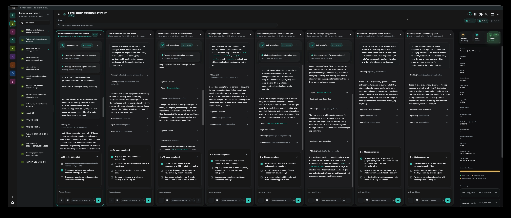

# Better OpenCode Client (BOC)

[English](README.md) | [简体中文](README.zh-CN.md) | [繁體中文](README.zh-TW.md) | [한국어](README.ko.md) | [Deutsch](README.de.md) | [Español](README.es.md) | [Français](README.fr.md) | [Italiano](README.it.md) | [Dansk](README.da.md) | [日本語](README.ja.md) | [Polski](README.pl.md) | [Русский](README.ru.md) | [Bosanski](README.bs.md) | [العربية](README.ar.md) | [Norsk](README.no.md) | [Português (Brasil)](README.pt-BR.md) | [ไทย](README.th.md) | [Türkçe](README.tr.md) | [Українська](README.uk.md) | [বাংলা](README.bn.md) | [Ελληνικά](README.el.md) | [Tiếng Việt](README.vi.md)

<p align="center">
  
</p>

OpenCode từ xa, không cần dính chặt vào bàn làm việc.

BOC là client Flutter đa nền tảng để dùng OpenCode từ xa trên iOS, Android, macOS và Windows. Ứng dụng được thiết kế quanh khả năng tương thích với OpenCode `1.4.3` và tập trung vào những việc bạn thật sự cần khi rời khỏi máy làm việc chính: kết nối server, tiếp tục workspace, theo dõi sessions, trả lời requests, kiểm tra context và chạy lệnh shell khi cần.

Bạn có màn hình rộng?



BOC có thể mở rộng thành một trung tâm điều khiển nhiều pane cho session monitoring, Review, files, context, shell output và hoạt động workspace song song.

## Vì sao chọn BOC

- **Remote-first workflow**: lưu OpenCode servers, kiểm tra trạng thái kết nối và nhanh chóng quay lại đúng workspace.
- **Điều khiển mobile-native**: điều hướng thân thiện với cảm ứng, layout gọn, nhập bằng giọng nói, file attachments, notifications và thao tác một tay.
- **Workspace cấp desktop**: màn hình rộng có split panes, side panels, danh sách sessions, bề mặt Review và chi tiết context mà không biến thành giao diện mobile chật chội.
- **Phản hồi vận hành trực tiếp**: shell output, pending questions, permissions, todos, context usage và session activity vẫn hiển thị khi công việc đang chạy.
- **Quản lý server dễ đoán**: server entries dễ quét, refresh, chỉnh sửa, xóa và kết nối lại.

## Tính năng chính

- Quản lý nhiều remote OpenCode servers từ một home screen đơn giản.
- Probe sức khỏe và khả năng tương thích của server trước khi vào workspace.
- Duyệt projects và sessions, bao gồm recent prompts và active child sessions.
- Chat với OpenCode sessions bằng slash commands, attachments, chọn model và reasoning controls.
- Trả lời pending questions và permission requests mà không mất vị trí trong cuộc trò chuyện.
- Kiểm tra context usage, files, review diffs, inbox items, todos và shell activity từ các pane riêng.
- Chạy terminal tabs khi UI hướng dẫn chưa đủ.
- Dùng adaptive layouts trên điện thoại, máy tính bảng, laptop và màn hình desktop.

## Tương thích

BOC hướng tới OpenCode `1.4.3`. Quy trình xác thực release-prep hiện tại tập trung vào connection probing, workspace/session loading, chat, shell và terminal flows, pending questions, permission requests, review/files/context panes và adaptive multi-pane layouts.

Nền tảng client được hỗ trợ:

- iOS
- Android
- macOS
- Windows

OpenCode server vẫn chạy từ xa; BOC là giao diện client để kết nối tới server đó, không phải là phần thay thế server.

## Yêu cầu

- Flutter với Dart SDK tương thích `^3.11.1`
- Một OpenCode `1.4.3` server có thể truy cập được
- Platform toolchains cho các target bạn định chạy: iOS, Android, macOS hoặc Windows

## Bắt đầu

```bash
flutter pub get
flutter run
```

Sau đó thêm OpenCode server của bạn từ home screen, xác nhận connection probe thành công và mở một workspace.

Chạy trên thiết bị cụ thể:

```bash
flutter devices
flutter run -d <device-id>
```

## Phát triển

Dùng cùng các kiểm tra như CI của dự án:

```bash
flutter analyze
flutter test
```

## Trạng thái dự án

BOC đang được chuẩn bị để release. Trọng tâm hiện tại là độ ổn định, UX đa nền tảng dễ đoán và khả năng tương thích với phiên bản OpenCode được hỗ trợ.
